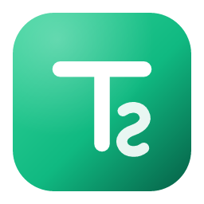

<p align="center">
  
</p>

<h1 align="center">TrapSpoofer</h1>

<p align="center">
  Ferramenta de desktop para substituir (spoofar) assets do Roblox.
  <br>
  Escaneie, previa, re-suba e troque animações, sons, imagens e meshes em um lugar inteiro — sem editar instância por instância.
</p>

<p align="center">
  <kbd>Animações</kbd>&nbsp;&nbsp;
  <kbd>Sons</kbd>&nbsp;&nbsp;
  <kbd>Imagens</kbd>&nbsp;&nbsp;
  <kbd>Meshes</kbd>&nbsp;&nbsp;
  <kbd>Arquivos .rbxl / .rbxm</kbd>&nbsp;&nbsp;
  <kbd>MCP (IA)</kbd>
</p>

<p align="center">
  <sub>Tauri 2 · Rust · React 19 · Luau</sub>
</p>

<p align="center">
  <a href="https://github.com/TrapstarKS/TrapSpoofer/releases/latest">Download</a>
  ·
  <a href="https://github.com/TrapstarKS/TrapSpoofer/issues/new">Reportar um bug</a>
</p>

<br>

---

> **Aviso.** O TrapSpoofer é uma ferramenta para trabalhar com assets do Roblox. Use apenas com conteúdo que você tem direito de usar. Você é responsável por respeitar os Termos de Uso do Roblox e os direitos de terceiros.

TrapSpoofer é um fork bastante reformulado do [ISpooferMotion V2](https://github.com/ISpooferMotion/ISpooferMotion-V2), com foco em três coisas: **interface simples e didática**, **modo arquivo** (funciona sem o Studio aberto) e **integração com IA via MCP**.

---

## O que ele faz

O app conversa direto com uma sessão do Roblox Studio através de um plugin Luau companheiro. Uma vez conectado, os assets são descobertos, re-enviados para a sua conta (ou grupo) e os novos IDs são aplicados de volta no place inteiro — sem procurar instância por instância.

<table>
  <tr>
    <td width="25%" valign="top">
      <strong>Fluxo guiado</strong><br><br>
      <sub>Um passo a passo claro: Fonte → Revisar → Enviar → Aplicar. Nada de menus escondidos.</sub>
    </td>
    <td width="25%" valign="top">
      <strong>Modo arquivo</strong><br><br>
      <sub>Abra um <code>.rbxl</code>/<code>.rbxlx</code>/<code>.rbxm</code>/<code>.rbxmx</code>, spoofe e salve uma cópia nova — sem precisar do Studio aberto.</sub>
    </td>
    <td width="25%" valign="top">
      <strong>Servidor MCP</strong><br><br>
      <sub>Deixe assistentes de IA (Claude Code, Claude Desktop, Cursor) escanear, spoofar e aplicar por você.</sub>
    </td>
    <td width="25%" valign="top">
      <strong>Contas &amp; grupos</strong><br><br>
      <sub>Gerencie várias contas Roblox e chaves Open Cloud, com credenciais guardadas pelo sistema operacional.</sub>
    </td>
  </tr>
</table>

---

## Instalação

Baixe a última versão na [página de releases](https://github.com/TrapstarKS/TrapSpoofer/releases/latest).

| Plataforma | Pacote                              |
| ---------- | ----------------------------------- |
| Windows    | `TrapSpoofer_x.x.x_x64-setup.exe`   |
| macOS      | `TrapSpoofer_x.x.x_x64.dmg`         |
| Linux      | `TrapSpoofer_x.x.x_amd64.AppImage`  |

O plugin do Roblox Studio (`TrapSpoofer.rbxmx`) acompanha cada release. O app instala e sincroniza esse plugin automaticamente nas pastas de plugins locais do Studio quando é aberto.

> [!NOTE]
> O Windows Defender e outros antivírus podem sinalizar builds não assinados. O TrapSpoofer não tem assinatura de código comercial. Você pode verificar compilando o projeto a partir do código-fonte.

---

## Como usar (resumo)

1. **Contas** — adicione uma conta Roblox: o cookie `.ROBLOSECURITY` (conta que **baixa**) e uma **Open Cloud API Key** com escopo *Assets: read + write* (credencial que **envia**). O app pode detectar o cookie do Studio/navegador automaticamente.
2. **Fonte** — escaneie o Studio, abra um arquivo `.rbxl`/`.rbxm` ou cole IDs.
3. **Revisar** — selecione os assets que precisam ser spoofados (o app marca quais já são seus).
4. **Enviar** — clique em *Iniciar spoof*. Ele baixa e re-sobe cada asset.
5. **Aplicar** — os novos IDs vão para o Studio (ou para um arquivo `.rbxm` novo, no modo arquivo). Salve o place.

---

## Integração com IA (MCP)

O TrapSpoofer expõe um servidor [MCP](https://modelcontextprotocol.io) local, então um assistente de IA pode dirigir o app: `get_status`, `scan_studio`, `scan_file`, `list_assets`, `spoof_assets`, `get_job`, `push_to_studio`, `replace_ids`, `write_spoofed_file`, entre outros. A aba **IA / MCP** dentro do app mostra a URL, o status e os trechos de configuração prontos para copiar.

- **Claude Code:** `claude mcp add --transport http trapspoofer http://127.0.0.1:14380/mcp`
- **Claude Desktop / Cursor (stdio):**
  ```json
  {
    "mcpServers": {
      "trapspoofer": { "command": "C:/caminho/para/TrapSpoofer.exe", "args": ["--mcp"] }
    }
  }
  ```

O servidor só aceita conexões locais e pode ser desligado nas configurações.

---

## Desenvolvimento

### Requisitos

| Requisito     | Versão        |
| ------------- | ------------- |
| Rust          | Stable atual  |
| Bun           | 1.x ou maior  |
| Node.js       | 20 ou maior   |
| Tauri         | 2.x           |
| Roblox Studio | Atual         |

No Linux, o Tauri também exige: `libwebkit2gtk-4.1-dev`, `libssl-dev`, `libayatana-appindicator3-dev`, `librsvg2-dev`.

### Rodar

```bash
git clone https://github.com/TrapstarKS/TrapSpoofer.git
cd TrapSpoofer

bun install
bun run tauri:dev
```

<details>
<summary><strong>Comandos úteis</strong></summary>

<br>

| Comando                | Descrição                                          |
| ---------------------- | -------------------------------------------------- |
| `bun run tauri:dev`    | Inicia o app desktop em modo de desenvolvimento    |
| `bun run check`        | Roda toda a suíte de validação                     |
| `bun run build:plugin` | Compila o plugin do Studio em `dist-plugin/`       |
| `bun run format`       | Formata TypeScript, Rust e Luau                    |
| `bun run test`         | Roda os testes de frontend (Vitest)                |
| `bun run rust:test`    | Roda os testes de Rust                             |

</details>

---

## Estrutura do projeto

```text
TrapSpoofer/
├── src/            UI React/TypeScript (services/, stores/, mcp/, components/)
├── src-tauri/      Backend Rust/Tauri, bridge do Studio e servidor MCP
├── plugin/         Plugin Luau do Roblox Studio
├── scripts/        Scripts de build
└── .github/        CI e templates
```

---

## Créditos e licença

Baseado no **ISpooferMotion V2** de IncredibroXP. O TrapSpoofer é licenciado sob a **GNU General Public License v3.0 ou posterior** — veja [`LICENSE`](LICENSE).
